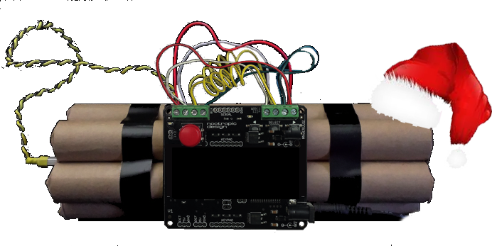

# bomb_timer



### Build and Installation Instructions

To build and install the application for Linux, follow these steps:

1. Ensure you have Flutter installed and set up for Linux development.
2. Run the provided `update.sh` script to build and install the application:
   ```bash
   ./update.sh
   ```

This script will:

- Rebuild the Flutter app in release mode.
- Increment the release number in the `PKGBUILD` file.
- Build and install the package using `makepkg`.

### Running the Application

After installation, you can run the application by executing the binary from its installation directory or using the desktop entry if one is created.

### In-App Hotkeys

- **Start Timer**: `1` for an hour timer
- **Pause Timer**: `2`
- **Reset Timer**: `R` reset timer
- **Exit Application**: `Ctrl + Q` not implemented yet

## Local Linux-dev

- **flutter run -d linux**

### Notes

- Ensure all dependencies required by `makepkg` are installed on your system.
- For more details on Flutter setup for Linux, refer to the [Flutter documentation](https://docs.flutter.dev/get-started/install/linux).
- Modify the `update.sh` script as needed for your specific environment.
